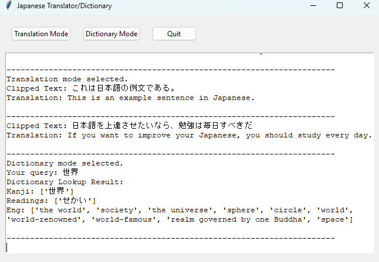

# Japanese Translator + Dictionary 

A  desktop application for translating Japanese text into English and automating dictionary look-ups. The application reads from the device clipboard and displays translations or definitions on a GUI based on the selected mode.

This is a personal project meant to aid in my Japanese studying, particularly the vocabulary and comprehension aspect. When going through unfamiliar text, I found that I had to pause quite often to copy a sentence or word and then paste it into a translator/dictionary respectively. This program is meant to assist in that process so that once the text is copied it will be translated or queried automatically. 

## Usage/Examples

1. To start the application, run: `python src/scripts/main.py`
2. Select desired mode (Default: Translation)
3. Copy text to clipboard, dictionary mode requires copied text be a valid, standalone Japanese word.  
4. Switch between the modes by clicking the buttons for Translation or Dictionary. 
5. Program will continuously monitor the device clipboard for changes until exited. 
## Installation

1. Install the project:
`git clone https://github.com/KKENN-rook/JP-translator.git`

2. Install dependencies:
`pip install -r requirements.txt`  

3. Download JMDict (required for dictionary usage): 
Direct download: [JMDict_e.gz](<http://ftp.edrdg.org/pub/Nihongo/JMdict_e.gz>)  
Source: [JMdict-EDICT Dictionary Project](<https://www.edrdg.org/wiki/index.php/JMdict-EDICT_Dictionary_Project#JMdict/EDICT_JAPANESE/ENGLISH_DICTIONARY_PROJECT>)

4. Set up environmental variables:
Create a .env file in the project root directory and add your DeepL API key:
`DEEPL_API_KEY=your_deepl_api_key`
## Running Tests

To run tests, to check your basic installation run: `python -m unittest discover -s tests`

## Features

- **Translation Mode**: 
  - Automatically translates copied Japanese sentences and phrases to English using the DeepL API.
  - Displays the original Japanese text along with the English translation in the GUI.

- **Dictionary Mode**: 
  - Provides detailed dictionary definitions for Japanese words using the JMdict database.
  - Displays the queried word along with its kanji, readings, and meanings in the GUI.

- **Clipboard Monitoring**: 
  - Continuously monitors the system clipboard for new Japanese text and processes it according to the selected mode.
  - Uses a separate thread to ensure the GUI remains responsive.

- **Graphical User Interface (GUI)**: 
  - User-friendly interface built with `tkinter`.
  - Allows easy switching between translation and dictionary modes with buttons.
  - Displays results in a textbox with each entry separated by dashed lines for clarity.

- **Caching**: 
  - Uses an LRU (Least Recently Used) cache to store recent translations.
  - Reduces the number of API calls by reusing cached results for repeated queries.

- **Configuration via Environment Variables**: 
  - Securely manages API keys and other sensitive information using environment variables stored in a `.env` file.
  - Loads configuration settings at runtime, keeping the codebase clean and secure.

- **Extensible**: 
  - Modular design allows for easy addition of new features and functionalities.
## Roadmap

- Add a 'clear screen' feature to UI.
- Allow current mode to be indicated by GUI buttons instead of text.
- Introductory message on program start-up with instructions
- TBD